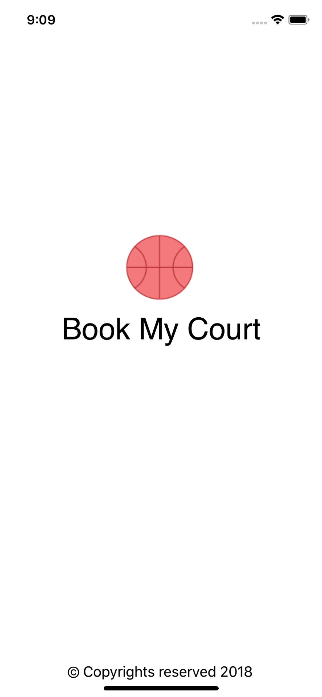
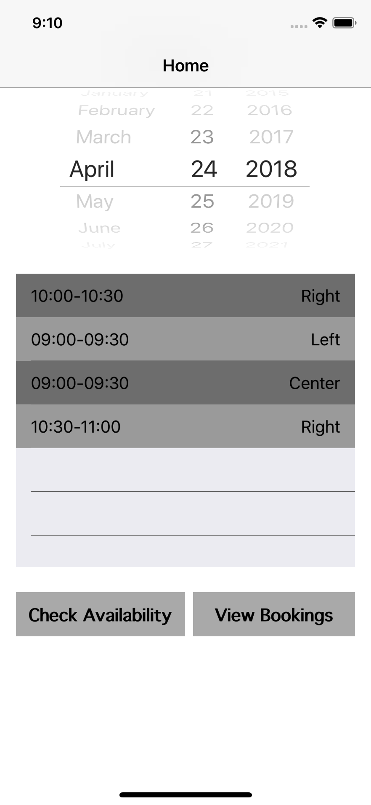
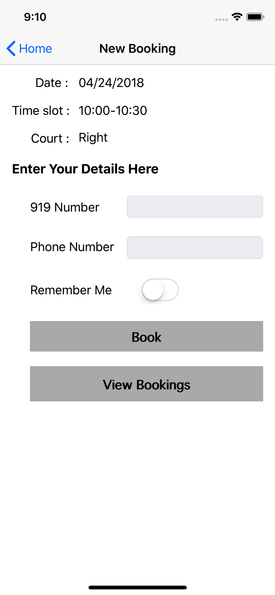
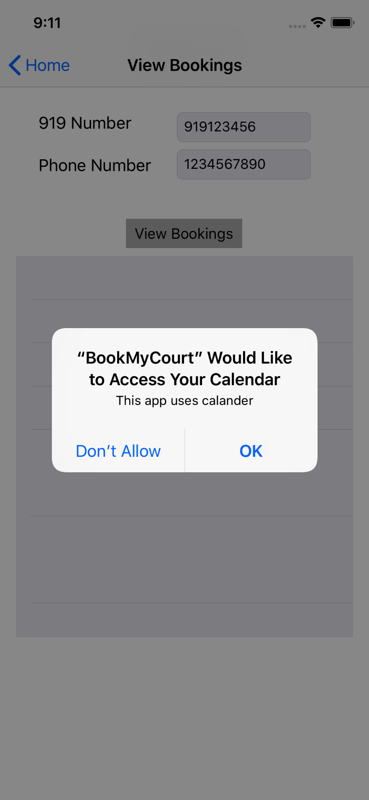
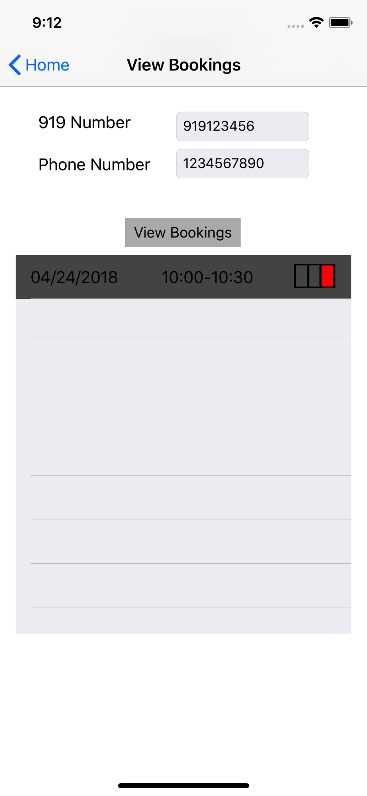
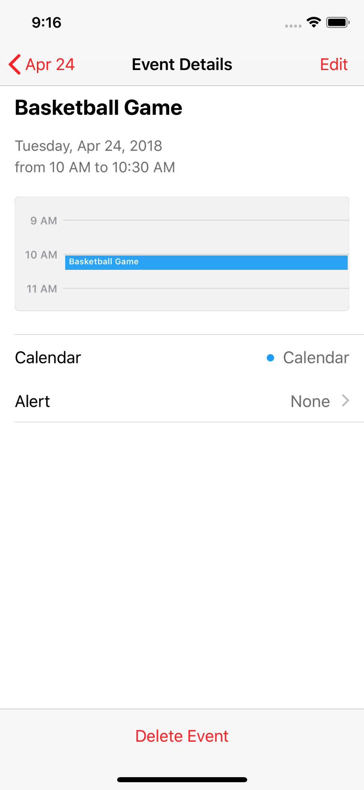

# BookMyCourt
iOS Team Rangnarok
-Revanth, Ashok, Srikar Karthik
## Authors

 
## Introduction
Students in NWMSU have no flexibility to reserve a court in Recreation center online or through mobile app.
### Proposed solution
A Mobile Application through which students can reserve the basketball court in student recreation arena on specific date and time.
## Features and status of completion
- User can check the availability of basketball courts – <b>Completed</b>
- User should enter the student ID, Phone Number for reserving a court – <b>Completed</b>
- App remembers the user if he/she choose to remember him/her - <b>Completed</b>
- If the user is valid the booking is confirmed or the court will be moved back to available state – <b>Completed</b>
- User can view his past bookings – <b>Completed</b>
- User receives push notification after completion of a reservation – <b>Completed</b>
- Available courts needs to be refreshed every week - <b>In Progress</b>
- Testing – <b>Completed</b>
## Screenshots

## Description of Persistent Data
- We used Back4App as MBaaS provider.
- Linked App to Parse Framework.
- Used Parse Library to perform CRUD operations on the cloud storage using noSQL database.
## API/Library
We have used API and Libraries that are part of the course material.
## Problems Faced
- Tried to implement Pointers concept in parse for implementing relational behavior.
- Unable to load data into Table view without user intervention.
## Future Improvements
- Extending these functionalities to other sports.
- Implementing an online chat with the facility provider.
- Providing a flexibility share the reservation information to other users.

 
